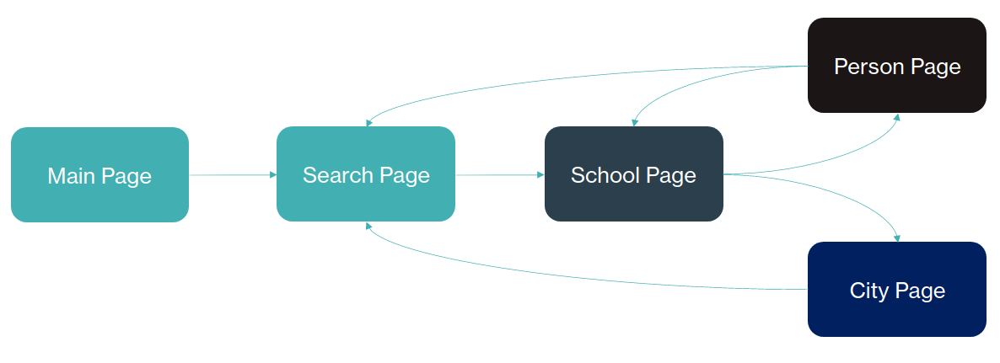

# Gesearch - Search Engine for French Universities

Search Engine for French Universities based on DBpedia (https://www.dbpedia.org/) and implemented with KotlinJS and its React framework.

This project has been realized in the as part of the semantic web course (INSA Lyon 4IFA). We realized this project over a period of 3 weeks and as a team of 5 people.

The website is available at https://pereduromega.github.io/SemanticWeb.

## The idea

Geasearch is a search engine which aims at finding information about the French universities.
The application is composed of several pages : 
- Main page : it displays the main search bar of the application.
- Search page : it displays the results found by the search engine. It lists the main information of the universities in the result and shows their location on a map. 
- School page : it displays all the information about a university. It also lists some alma mater and teacher of the university. 
- Person page : it displays all the information about a person. It also displays the educational background of the person thus allowing the user to check the information of the associated schools. 
- City page : it displays all the information about a city. The user can reach this page by clicking on the location of the university in the school page or on the related pin on the map.
## Application navigation graph

You can see below the navigation graph of the application which shows the relations between the different pages.



## How does it works ?

The search engine has an autocomplete feature to facilitate your searches. 
It uses the DBpedia Lookup (https://lookup.dbpedia.org/) feature to find ressources which match with the key words in input.
This search engine uses SPARQL queries based on the resources found with the Lookup to search in the DBpedia database and get information about the universities.


# How to use the search engine ?

You can check the project on the following URL : 

//TODO Ajouter le lien vers le pages

# How to run the project locally ?

## Requirements
<a href="https://www.jetbrains.com/fr-fr/idea/"></a>

<a href="https://kotlinlang.org/">
&nbsp;&nbsp;&nbsp;&nbsp;
</a>

<a href="https://gradle.org/">
&nbsp;&nbsp;&nbsp;&nbsp;
</a>

<a href="https://en.reactjs.org/">
&nbsp;&nbsp;&nbsp;&nbsp;&nbsp;&nbsp;&nbsp;
</a>

## Setup the project

Firstly, you need to pull the project in an IntelliJ IDEA's new project. <br/> 

Then, you need to make a Gradle clean of the project : 
```
gradle clean
```
After that, you can build the project with Gradle : 
```
gradle build
```
Finally, you can run the project using the Gradle browserRun : 
```
gradle browserRun
```


# Final notes
//TODO si jamais vous avez d'autres idées/commentaires

